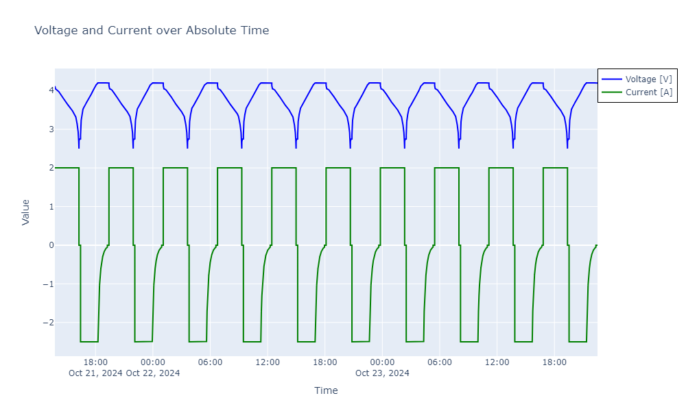
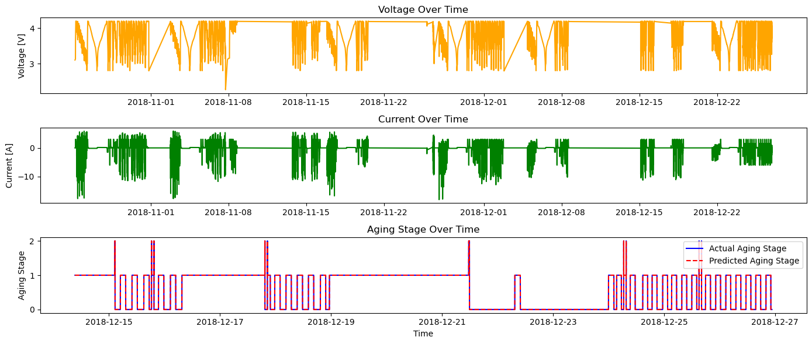

# Battery Aging Classification using PyBAMM

This repository contains code and models for simulating battery aging data using PyBAMM and classifying the aging stages (Early, Mid, End) using machine learning algorithms.

## Project Overview

This project utilizes PyBAMM (Python Battery Mathematical Modeling) along with real-world battery data collected by Dr. Phillip Kollmeyer and colleagues at McMaster University to simulate battery data over different charge and discharge cycles. The goal is to predict the aging stage of the battery using features such as capacity, voltage, current, and other factors.

### Original Data Source

The dataset used in this project originates from research conducted at McMaster University, Ontario, Canada, and is publicly available on Mendeley Data (link). This data was collected by Dr. Phillip Kollmeyer and colleagues as part of their work on State-of-Charge (SOC) estimation for lithium-ion batteries using a deep feedforward neural network (FNN) approach.

#### Original Data Citation:

Philip Kollmeyer, Carlos Vidal, Mina Naguib, Michael Skells. LG 18650HG2 Li-ion Battery Data and Example Deep Neural Network xEV SOC Estimator Script. Published: March 6, 2020. DOI: 10.17632/cp3473x7xv.3

The data was collected using an LG 18650HG2 battery cell, tested in a thermal chamber and analyzed with a Digatron Universal Battery Tester. The dataset includes various features such as **Voltage [V]**, **Current [A]**, **Temperature [C]**, **Capacity [Ah]**, and **WhAccu [Wh]**.

### Key Features:
- **Battery Aging Data Simulation**: Combine PyBAMM simulations with real-world battery data to model battery behavior over multiple charge-discharge cycles.
- **Data-Driven Classification**: Train machine learning models to classify battery health into aging stages based on the combined simulated and real data.
- **Real-World Application**: The project is designed to support further integration with battery data from real-world manufacturing or testing environments.

## Folder Structure

- **`data/`**: Contains the generated battery aging data (`battery_aging_data.csv`).
- **`notebooks/`**: Jupyter notebooks for simulation experiments and data analysis.
- **`scripts/`**: Python scripts for data generation, model training, and evaluation.
- **`models/`**: Pre-trained models (e.g., Random Forest, LSTM) saved for future use.
- **`requirements.txt`**: Python dependencies required to run the project.
- **`.gitignore`**: Files and folders to ignore in version control.

## Getting Started

### Prerequisites

Make sure you have Python 3.x installed on your machine. Install the required dependencies using the `requirements.txt` file:

```bash
pip install -r requirements.txt
```

## Experiment Results

### Data Source and Experiment Setup

The dataset used in this project originates from research conducted at McMaster University, Ontario, Canada, and is publicly available on Mendeley Data. This data was collected by Dr. Phillip Kollmeyer and colleagues as part of their work on State-of-Charge (SOC) estimation for lithium-ion batteries using a deep feedforward neural network (FNN) approach.

#### Original Data Citation:

Philip Kollmeyer, Carlos Vidal, Mina Naguib, Michael Skells. LG 18650HG2 Li-ion Battery Data and Example Deep Neural Network xEV SOC Estimator Script. Published: March 6, 2020. DOI: 10.17632/cp3473x7xv.3

The data was collected using an LG 18650HG2 battery cell, tested in a thermal chamber and analyzed with a Digatron Universal Battery Tester. The dataset includes various features such as **Voltage [V]**, **Current [A]**, **Temperature [C]**, **Capacity [Ah]**, and **WhAccu [Wh]**.

### Key Experiment Details:

#### Feature Engineering:
- **Voltage_Avg, Current_Avg, Temperature_Avg**: Calculated average voltage, current, and temperature per step to understand the battery's state in different stages.
- **Delta_Capacity**: Change in capacity between consecutive steps, used as an indicator of degradation.
- **Cycle_Count**: Created to represent individual charge-discharge cycles for battery aging classification.

### Machine Learning Model for Aging Classification

The data was used to classify the battery's aging stages into categories such as **Aged**, **Moderate Aging**, and **Healthy**. The features used for the model included:
- **Voltage [V]**, **Current [A]**, **Temperature [C]**, **Capacity [Ah]**, **Voltage_Avg**, **Current_Avg**, **Temperature_Avg**, **Delta_Capacity**

The target variable for classification was the **Aging_Label**, derived from capacity thresholds to indicate the aging state. Specifically:
- **Healthy**: The battery is considered healthy when its capacity is above **85%** of the initial capacity.
- **Moderate Aging**: The battery is classified as moderately aged when the capacity drops between **70% and 85%** of the initial capacity.
- **Aged**: The battery is classified as aged when the capacity drops below **70%** of the initial capacity.

These thresholds were determined based on industry standards and common practices for assessing battery health.

#### Number of Samples for Each Aging Label
- **Healthy**: There were **63,769** samples classified as `Healthy`, indicating the battery was still functioning well above 85% of its original capacity.
- **Moderate Aging**: There were **44,521** samples classified as `Moderate Aging`, indicating some capacity degradation but still within an acceptable range for use.
- **Aged**: There were **176** samples classified as `Aged`, indicating significant degradation with capacity falling below 70% of the original.

These class distributions show that the majority of the samples were either in the `Healthy` or `Moderate Aging` stages, while only a small number of samples were classified as `Aged`. This imbalance in the dataset could influence model performance, especially for the `Aged` class, and is something we took into account during model evaluation and interpretation.

#### Model Training and Evaluation:
- We used a **Random Forest Classifier** as the primary model for battery aging classification.
- The data was split using a **time-based split** approach to ensure temporal consistency, with 80% of the data used for training and 20% for testing.
- The features were **normalized** using **MinMaxScaler**, and the target labels were **encoded** using **LabelEncoder**.

#### Evaluation Metrics:
- **Classification Report**:
  - Precision, Recall, and F1-score were nearly perfect for the classes **Healthy** and **Moderate Aging**.
  - For the **Aged** class, a few misclassifications were observed, but overall performance was still very strong.
- **Accuracy Score**: **99.99%**, indicating that the model is making almost all predictions correctly.
- **Confusion Matrix**:
  - Showed very few false positives and false negatives, especially for the **Aged** class.

### Observations:
- **Voltage and Current Behavior**: The voltage varied between 2.5V and 4.2V during charge-discharge cycles, and the current reversed between positive and negative values, indicating proper operation.
- **Aging Trends**: Initially, no significant signs of degradation were observed over a small number of cycles. However, aging effects are expected to become more visible with extended cycling.

### Plots:

1. **Voltage and Current vs. Time**: This plot shows the voltage and current behavior during the 10 charge-discharge cycles. The consistent pattern indicates stable battery behavior across all cycles.

   

2. **Voltage, Current, and Aging Stage Over Time**: The following plot provides a comprehensive view of how the **voltage** and **current** evolve over time along with the **actual and predicted aging stages**.

   

   - **Voltage Over Time**: Voltage variations show typical charge and discharge cycles, with fluctuations observed over the experimental period. The voltage fluctuates between 2.5V and 4.2V, indicating normal battery operation.
   - **Current Over Time**: Current also shows the expected patterns of charging (positive values) and discharging (negative values) throughout the cycles.
   - **Aging Stage Over Time**: The bottom plot shows both the **actual aging stage** (solid blue line) and the **predicted aging stage** (dashed red line) over time. The predicted values closely match the actual values, demonstrating the model's ability to accurately predict the battery's aging stages.
   - **Key Insight**: The model is performing well, especially in identifying the transitions between aging stages. There are occasional mismatches, particularly during rapid transitions, but overall the predicted aging stage follows the actual trend effectively. This consistency across both `Healthy`, `Moderate Aging`, and `Aged` stages shows that the model has successfully learned the aging patterns from the data.


### Next Steps:

- **Feature Importance Analysis**: Understand which features contribute the most to the model's predictions.
- **Cross-Validation**: Evaluate the model using cross-validation to ensure robustness across different subsets of the data.
- **Extended Cycling**: Run additional simulations and data collection for more cycles to observe gradual aging effects and improve the classification model.

## Experiment Setup 2: HPPC and OCV Tests

We performed further simulations using **HPPC (High-Pulse Power Characterization)** and **OCV (Open Circuit Voltage)** tests to evaluate battery performance and understand degradation characteristics. These tests included dynamic charge and discharge profiles followed by rest periods, mimicking real-world battery test conditions.

### Key Experiment Details:

1. **HPPC Test**:
   - Discharge at 1 A for 10 seconds.
   - Rest for 10 minutes.
   - Discharge at 2 A for 10 seconds.
   - Rest for 10 minutes.
   - Charge at 1 A for 10 seconds.
   - Rest for 10 minutes.

2. **OCV Test**:
   - Charge at 0.1 A until 4.1 V.
   - Hold at 4.1 V until the current drops to 50 mA.
   - Rest for 1 hour.
   - Discharge at 0.1 A until 3.0 V.
   - Rest for 1 hour.

### Overview of the Tests:

- **HPPC Test**: Used to determine internal resistance by subjecting the battery to high-power pulses and measuring voltage response.
- **Dynamic (DYN) Tests**: Simulate real-world power demands to observe battery behavior under dynamic loading.
- **OCV Test**: Measure the relationship between SOC and open circuit voltage, capturing data after each rest period to understand equilibrium behavior.

### Simulation Results:

- **HPPC and OCV Data**: Data collected from these tests include **Voltage**, **Current**, **SOC (State of Charge)**, and **Temperature** over time.
- These results will be used in further training to improve the aging classification model.

### Next Steps:

- **Integrate New Data**: Use data from HPPC and OCV tests to enrich the training dataset.
- **Model Optimization**: Tune hyperparameters and test additional machine learning algorithms to improve classification accuracy.
