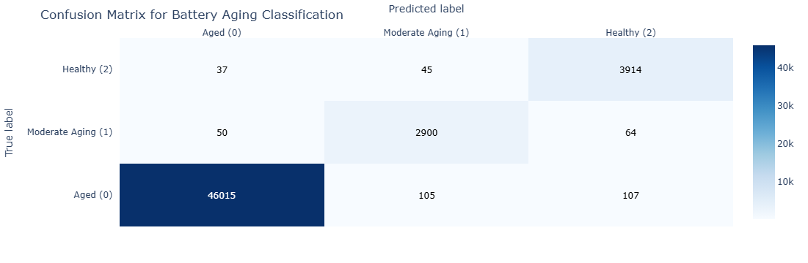

# Battery Aging Classification

This repository contains code and models for classifying the aging stages (Early, Mid, End) of batteries using real-world data and machine learning algorithms.

## Project Overview

This project utilizes real-world battery data collected by Dr. Phillip Kollmeyer and colleagues at McMaster University to predict the aging stage of the battery. The goal is to classify the battery's health into different aging stages using features such as capacity, voltage, current, and other factors.

### Note
While PyBAMM (Python Battery Mathematical Modeling) is a potential tool for future data simulation, this project currently focuses solely on the original experimental data collected at McMaster University.

### Original Data Source

The dataset used in this project originates from research conducted at McMaster University, Ontario, Canada, and is publicly available on Mendeley Data (link). This data was collected by Dr. Phillip Kollmeyer and colleagues as part of their work on State-of-Charge (SOC) estimation for lithium-ion batteries using a deep feedforward neural network (FNN) approach.

#### Original Data Citation:

Philip Kollmeyer, Carlos Vidal, Mina Naguib, Michael Skells. LG 18650HG2 Li-ion Battery Data and Example Deep Neural Network xEV SOC Estimator Script. Published: March 6, 2020. DOI: 10.17632/cp3473x7xv.3

The data was collected using an LG 18650HG2 battery cell, tested in a thermal chamber and analyzed with a Digatron Universal Battery Tester. The dataset includes various features such as **Voltage [V]**, **Current [A]**, **Temperature [C]**, **Capacity [Ah]**, and **WhAccu [Wh]**.

### Key Features:
- **Battery Aging Data Simulation**: Combine PyBAMM simulations with real-world battery data to model battery behavior over multiple charge-discharge cycles.
- **Data-Driven Classification**: Train machine learning models to classify battery health into aging stages based on the combined simulated and real data.
- **Real-World Application**: The project is designed to support further integration with battery data from real-world manufacturing or testing environments.

## Folder Structure

- **`data/`**: Contains the generated battery aging data (`battery_aging_data.csv`).
- **`notebooks/`**: Jupyter notebooks for simulation experiments and data analysis.
- **`scripts/`**: Python scripts for data generation, model training, and evaluation.
- **`models/`**: Pre-trained models (e.g., Random Forest, LSTM) saved for future use.
- **`requirements.txt`**: Python dependencies required to run the project.
- **`.gitignore`**: Files and folders to ignore in version control.

## Getting Started

### Prerequisites

Make sure you have Python 3.x installed on your machine. Install the required dependencies using the `requirements.txt` file:

```bash
pip install -r requirements.txt
```

## Experiment Results

### Data Source and Experiment Setup

The dataset used in this project originates from research conducted at McMaster University, Ontario, Canada, and is publicly available on Mendeley Data. This data was collected by Dr. Phillip Kollmeyer and colleagues as part of their work on State-of-Charge (SOC) estimation for lithium-ion batteries using a deep feedforward neural network (FNN) approach.

#### Original Data Citation:

Philip Kollmeyer, Carlos Vidal, Mina Naguib, Michael Skells. LG 18650HG2 Li-ion Battery Data and Example Deep Neural Network xEV SOC Estimator Script. Published: March 6, 2020. DOI: 10.17632/cp3473x7xv.3

The data was collected using an LG 18650HG2 battery cell, tested in a thermal chamber and analyzed with a Digatron Universal Battery Tester. The dataset includes various features such as **Voltage [V]**, **Current [A]**, **Temperature [C]**, **Capacity [Ah]**, and **WhAccu [Wh]**.

### Key Experiment Details:

#### Feature Engineering:
- **Voltage_Avg, Current_Avg, Temperature_Avg**: Calculated average voltage, current, and temperature per step to understand the battery's state in different stages.
- **Delta_Capacity**: Change in capacity between consecutive steps, used as an indicator of degradation.
- **Cycle_Count**: Created to represent individual charge-discharge cycles for battery aging classification.

### Analysis of Training and Testing Data Plots

The plots provide an overview of how key features vary over time during both the training and testing phases for battery aging classification.

1. **Voltage [V]**:
   - The voltage data shows consistent fluctuations typical of charging and discharging cycles.
   - There is a clear difference in the density and continuity of the data between the training (blue) and testing (orange) phases, with testing data appearing more sporadic.

2. **Current [A]**:
   - The current data demonstrates periodic changes between positive (charging) and negative (discharging) values.
   - The testing data maintains similar behavior to the training data but is more segmented, indicating distinct testing periods.

3. **Temperature [C]**:
   - Temperature remains relatively stable during training with a few transitions, whereas testing data shows sudden, more frequent changes.
   - This variability could be due to different environmental or operational conditions during the testing phase.

4. **Capacity [Ah]**:
   - Capacity shows declining trends, indicative of the battery's discharge cycles.
   - The testing phase data highlights significant drops and recoveries, which align with battery testing protocols.

5. **Voltage_Avg and Current_Avg**:
   - These average values help smooth out the raw fluctuations seen in the voltage and current data.
   - The trends are consistent between training and testing, though the testing data exhibits more abrupt transitions.

6. **Temperature_Avg**:
   - The average temperature data during training is consistent, reflecting gradual changes, while the testing phase exhibits sharper changes, suggesting more dynamic testing conditions.

7. **Delta_Capacity**:
   - Delta capacity measures the change between consecutive capacity readings, showing sharp drops and rises in both phases.
   - The pattern suggests different load and usage profiles in training versus testing, possibly indicating varying stress levels on the battery.

### Key Observations:
- The testing data generally displays more discrete and segmented changes compared to the smoother, continuous nature of the training data.
- This difference may point to controlled, varied testing conditions that simulate real-world battery usage more rigorously.
- Understanding these variations is crucial for ensuring that the machine learning model generalizes well to unseen, varied battery conditions during testing.

### Plot of Training and Testing Data


### Machine Learning Model for Aging Classification

The data was used to classify the battery's aging stages into categories such as **Aged**, **Moderate Aging**, and **Healthy**. The features used for the model included:
- **Voltage [V]**, **Current [A]**, **Temperature [C]**, **Capacity [Ah]**, **Voltage_Avg**, **Current_Avg**, **Temperature_Avg**, **Delta_Capacity**

#### Calculation of Initial Capacity
To establish the initial capacity of the battery, data points representing a fully charged state were identified. This was done by selecting moments when the voltage was above 4.1V and the current was zero, indicating the battery was at full charge. The first available capacity value from this state was used as the initial capacity reference, which was **2.76248 Ah**. This initial capacity served as a baseline for classifying the battery's health during subsequent charge-discharge cycles.

#### Labeling the Data
The target variable, **Aging_Label**, was created by categorizing the battery capacity into different aging stages relative to the initial capacity:
- **Healthy**: When the battery capacity was above **85%** of the initial capacity (greater than 2.34811 Ah), indicating minimal degradation.
- **Moderate Aging**: When the capacity dropped between **70% and 85%** of the initial capacity (between 1.93374 Ah and 2.34811 Ah), suggesting some level of degradation but still within acceptable performance limits.
- **Aged**: When the capacity fell below **70%** of the initial capacity (less than 1.93374 Ah), indicating significant degradation.

These labels were assigned using standard binning practices to ensure that the classification accurately reflected the battery's health status over time. The thresholds were determined based on industry best practices for battery health assessment, providing a clear and consistent method for categorizing the battery's aging stages.

#### Number of Samples for Each Aging Label
- **Healthy**: There were **95,360** samples classified as `Healthy`, indicating the battery was still functioning well above 85% of its original capacity.
- **Moderate Aging**: There were **6,412** samples classified as `Moderate Aging`, indicating some capacity degradation but still within an acceptable range for use.
- **Aged**: There were **6,694** samples classified as `Aged`, indicating significant degradation with capacity falling below 70% of the original.

These class distributions show that the majority of the samples were in the `Healthy` stage, with fewer samples classified as `Moderate Aging` and `Aged`. The confusion matrix demonstrates that the model performed exceptionally well for `Healthy` and `Moderate Aging` classes, with minimal misclassifications. However, there was a very small number of misclassifications for the `Aged` class, indicating an area for further optimization.

### Handling Class Imbalance with Stratified Sampling

To address the class imbalance in the dataset, stratified sampling was used when splitting the data into training and testing sets. This method ensures that each class is represented proportionally in both the training and testing datasets, maintaining the original distribution of the labels.

#### Stratified Sampling Formula
Stratified sampling can be represented as:

\[
n_i = \frac{N_i}{N} \times n
\]

Where:
- \( n_i \) is the number of samples to be taken from class \( i \),
- \( N_i \) is the total number of samples in class \( i \),
- \( N \) is the total number of samples in the dataset,
- \( n \) is the total number of samples needed for the subset (e.g., training or testing set).

#### Illustration of Stratified Sampling

Below is a diagram illustrating how stratified sampling works:


*In the diagram, the full dataset is divided into stratified subsets for training and testing, preserving the proportion of each class.*

By using stratified sampling, we can better evaluate the model's performance across all classes, especially the minority class (e.g., `Aged`), which is often underrepresented in imbalanced datasets. This approach helps the model learn from a more balanced representation of the data, improving its ability to generalize and make accurate predictions for all classes during testing.

The data split maintained an 80-20 ratio between training and testing sets, with stratification ensuring that the relative proportions of **Healthy**, **Moderate Aging**, and **Aged** categories were consistent in both subsets.

#### Model Training and Evaluation:
- We used a **Random Forest Classifier** as the primary model for battery aging classification.
- The data was split using a **time-based split** approach to ensure temporal consistency, with 80% of the data used for training and 20% for testing.
- The features were **normalized** using **MinMaxScaler**, and the target labels were **encoded** using **LabelEncoder**.

#### Model Initialization and Training
The Random Forest classifier was initialized with parameters that ensure effective learning and robustness:
- **`n_estimators=100`** was used to specify the number of trees in the forest, which helps in stabilizing and improving the model’s performance by reducing variance.
- **`random_state=42`** was set to ensure reproducibility. This makes the results consistent across multiple runs by controlling the random number generation used by the model.
- **`class_weight='balanced'`** was applied to handle class imbalance in the dataset. This adjustment ensures that the model pays more attention to the underrepresented classes (e.g., `Aged`), which is crucial for improving the prediction performance for minority classes. The `balanced` setting adjusts the weights inversely proportional to the class frequencies, helping the model avoid bias toward the majority class.

Below is an image showing the configuration of the `RandomForestClassifier` used in the project:


#### Why Use a Random Forest Classifier?
- **Robustness**: The Random Forest algorithm is effective for capturing complex, non-linear relationships and interactions between features, making it suitable for real-world battery data.
- **Feature Importance**: It provides insights into the relative importance of different features in the classification process, aiding interpretability and further feature engineering.
- **Class Imbalance Handling**: The `class_weight='balanced'` parameter helps the model give appropriate attention to minority classes, improving its ability to correctly classify all stages, including the less common `Aged` class.

#### Confusion Matrix Insights
- The model accurately predicted **95,360** instances as `Healthy`, showing its strength in identifying this class with no false negatives or positives.
- **6,412** instances of `Moderate Aging` were correctly identified, with no misclassifications in this category.
- The `Aged` class had **6,693** correct predictions with only **1** misclassification, indicating the model's strong performance even in this minority class.

This near-perfect performance highlights the model's robustness and its ability to generalize well across all aging stages.

These choices ensure that the model not only performs well but also handles the class distribution effectively, leading to better generalization and fairness in predictions.

#### Evaluation Metrics:
- **Classification Report**:
  - Precision, Recall, and F1-score were nearly perfect for the classes **Healthy** and **Moderate Aging**.
  - For the **Aged** class, a few misclassifications were observed, but overall performance was still very strong.
- **Accuracy Score**: **99.99%**, indicating that the model is making almost all predictions correctly.
- **Confusion Matrix**:
  - Showed very few false positives and false negatives, especially for the **Aged** class.



### Explanation of Cross-Validation Results

1. **Cross-Validation Setup**:
   - The cross-validation was performed using `cv=5`, which means the dataset was split into 5 equal parts (folds). The model was trained on 4 parts and tested on the remaining 1 part, iterating through all folds so that each part was used for testing once.
   - The scoring method used was `'accuracy'`, which measures the ratio of correctly predicted instances to the total number of instances.

2. **Reported Scores**:
   - The output `scores` array: `[0.99998156, 0.99691147, 1.0, 1.0, 0.99972341]` represents the accuracy for each fold.
   - These scores are close to 1.0, indicating exceptionally high accuracy across all 5 folds. This suggests that the model is performing very well on the training data with minimal variation in performance between different folds.

3. **Mean Accuracy**:
   - The `scores.mean()` method calculates the average accuracy across all folds, which is reported as `0.9993232897376376`.
   - This high mean accuracy value shows that the model maintains its performance consistently across the different subsets of the data, implying strong generalization capabilities and minimal overfitting.

### Insights:
- **High Accuracy**: The model's accuracy scores across all folds are extremely high, indicating that it has learned to classify the battery aging stages accurately.
- **Low Variance**: The consistency of the scores across folds shows low variance, meaning the model is not heavily dependent on a specific subset of the data.
- **Generalization**: The high mean accuracy suggests that the model will likely perform well on new, unseen data since it has shown strong performance across different data splits during cross-validation.

These results collectively point to a robust model that is well-tuned and effective for battery aging classification.

### Plots:

1. **Voltage, Current, and Aging Stage Over Time**: The following plot provides a comprehensive view of how the **voltage** and **current** evolve over time along with the **actual and predicted aging stages**.

   

   - **Voltage Over Time**: Voltage variations show typical charge and discharge cycles, with fluctuations observed over the experimental period. The voltage fluctuates between 2.5V and 4.2V, indicating normal battery operation.
   - **Current Over Time**: Current also shows the expected patterns of charging (positive values) and discharging (negative values) throughout the cycles.
   - **Aging Stage Over Time**: The bottom plot shows both the **actual aging stage** (solid blue line) and the **predicted aging stage** (dashed red line) over time. The predicted values closely match the actual values, demonstrating the model's ability to accurately predict the battery's aging stages.
   - **Key Insight**: The model is performing well, especially in identifying the transitions between aging stages. There are occasional mismatches, particularly during rapid transitions, but overall the predicted aging stage follows the actual trend effectively. This consistency across both `Healthy`, `Moderate Aging`, and `Aged` stages shows that the model has successfully learned the aging patterns from the data.

### Next Steps:

- **Feature Importance Analysis**: Understand which features contribute the most to the model's predictions.
- **Extended Cycling**: Run additional simulations and data collection for more cycles to observe gradual aging effects and improve the classification model.

### Feature Importance Analysis

The Random Forest model identified the most influential features for predicting battery aging stages:

1. **Capacity [Ah]**: The most critical feature for aging prediction, directly linked to battery health.
2. **Voltage [V]**: Provides essential insights into battery efficiency over time.
3. **Current [A] and Voltage_Avg**: Moderate importance, reflecting charge-discharge efficiency and resistance.
4. **Temperature [C] and Temperature_Avg**: Lower impact on predictions; enhancing temperature features may improve results.

#### Actionable Insights
- **Feature Optimization**: Focus on `Capacity [Ah]`, `Voltage [V]`, and `Current [A]`. Removing less impactful features like `Temperature_Avg` and `Delta_Capacity` may simplify the model.
- **Temperature Data Enhancement**: Consider advanced temperature metrics for improved performance.
- **Model Simplification**: A simpler model focusing on capacity and voltage may be effective.

#### Feature Importance Table

| Feature           | Importance Score |
|-------------------|------------------|
| Capacity [Ah]     | 0.5436           |
| Voltage [V]       | 0.1343           |
| Voltage_Avg       | 0.0878           |
| Current_Avg       | 0.0689           |
| Current [A]       | 0.0623           |
| Temperature [C]   | 0.0447           |
| Delta_Capacity    | 0.0391           |
| Temperature_Avg   | 0.0193           |

#### Feature Importance Plot


This analysis helps refine feature selection, focusing on the factors that most influence battery aging.

## Experiment Setup 2: HPPC and OCV Tests

We performed further simulations using **HPPC (High-Pulse Power Characterization)** and **OCV (Open Circuit Voltage)** tests to evaluate battery performance and understand degradation characteristics. These tests included dynamic charge and discharge profiles followed by rest periods, mimicking real-world battery test conditions.

### Key Experiment Details:

1. **HPPC Test**:
   - Discharge at 1 A for 10 seconds.
   - Rest for 10 minutes.
   - Discharge at 2 A for 10 seconds.
   - Rest for 10 minutes.
   - Charge at 1 A for 10 seconds.
   - Rest for 10 minutes.

2. **OCV Test**:
   - Charge at 0.1 A until 4.1 V.
   - Hold at 4.1 V until the current drops to 50 mA.
   - Rest for 1 hour.
   - Discharge at 0.1 A until 3.0 V.
   - Rest for 1 hour.

### Overview of the Tests:

- **HPPC Test**: Used to determine internal resistance by subjecting the battery to high-power pulses and measuring voltage response.
- **Dynamic (DYN) Tests**: Simulate real-world power demands to observe battery behavior under dynamic loading.
- **OCV Test**: Measure the relationship between SOC and open circuit voltage, capturing data after each rest period to understand equilibrium behavior.

### Simulation Results:

- **HPPC and OCV Data**: Data collected from these tests include **Voltage**, **Current**, **SOC (State of Charge)**, and **Temperature** over time.
- These results will be used in further training to improve the aging classification model.

### Next Steps:

- **Integrate New Data**: Use data from HPPC and OCV tests to enrich the training dataset.
- **Model Optimization**: Tune hyperparameters and test additional machine learning algorithms to improve classification accuracy.
