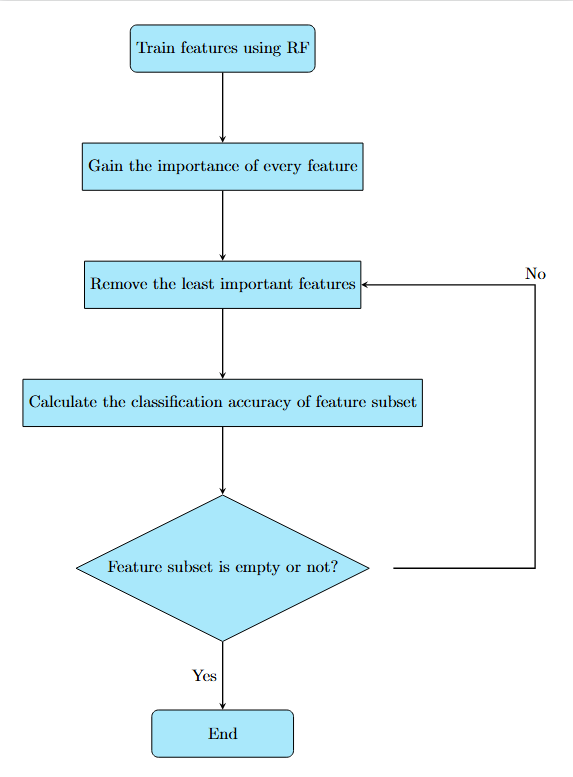

# 🔋 **Battery Aging Classification**

[](https://www.python.org/)
[](LICENSE)
[](https://github.com/user/repo)
[](#deployment-using-docker)
[](#documentation)

This repository contains code and models for classifying the aging stages (**Early**, **Mid**, **End**) of batteries using real-world data and machine learning algorithms.

---

## 📌 Project Overview

This project utilizes battery data collected by Dr. Phillip Kollmeyer and colleagues at McMaster University to classify the battery’s health into aging stages based on features like capacity, voltage, current, and more.

### 🔍 Note
While **PyBAMM** (Python Battery Mathematical Modeling) is a potential tool for future data simulation, this project currently focuses on the experimental data from McMaster University.

### 🏫 Original Data Source

The dataset used in this project originates from research at McMaster University, Ontario, Canada. Data was collected with an LG 18650HG2 battery cell, tested in a thermal chamber and analyzed with a Digatron Universal Battery Tester.  
[Dataset Link](https://doi.org/10.17632/cp3473x7xv.3)  
**Citation:**  
Philip Kollmeyer, Carlos Vidal, Mina Naguib, Michael Skells. *LG 18650HG2 Li-ion Battery Data and Example Deep Neural Network xEV SOC Estimator Script.* Published: March 6, 2020.

---

## 🔑 Key Features

- **Battery Aging Data Simulation**: Simulate battery behavior over multiple charge-discharge cycles using real-world data.
- **Data-Driven Classification**: Train ML models to classify battery health into aging stages.
- **Real-World Application**: Applicable to manufacturing or testing environments for battery quality monitoring.

---

## 📁 Folder Structure

- **`data/`**: Contains the generated battery aging data (`battery_aging_data.csv`).
- **`notebooks/`**: Jupyter notebooks for experiments and analysis.
- **`scripts/`**: Python scripts for data generation, training, and evaluation.
- **`models/`**: Pre-trained models saved for future use.
- **`requirements.txt`**: Python dependencies for the project.
- **`.gitignore`**: Ignored files for version control.

---

## 🚀 Getting Started

### Prerequisites

Ensure Python 3.x is installed. Install dependencies with:

```bash
pip install -r requirements.txt
```

## 🔬 Experiment Results

### 📊 Data Source and Experiment Setup

The dataset used in this project originates from research conducted at McMaster University, Ontario, Canada, and is publicly available on Mendeley Data. The data was collected by Dr. Phillip Kollmeyer and colleagues as part of their work on State-of-Charge (SOC) estimation for lithium-ion batteries using a deep feedforward neural network (FNN) approach.

#### 📝 Original Data Citation

Philip Kollmeyer, Carlos Vidal, Mina Naguib, Michael Skells. *LG 18650HG2 Li-ion Battery Data and Example Deep Neural Network xEV SOC Estimator Script*. Published: March 6, 2020. DOI: [10.17632/cp3473x7xv.3](https://doi.org/10.17632/cp3473x7xv.3)

The data was collected using an LG 18650HG2 battery cell, tested in a thermal chamber and analyzed with a Digatron Universal Battery Tester. Key features in the dataset include **Voltage [V]**, **Current [A]**, **Temperature [C]**, **Capacity [Ah]**, and **WhAccu [Wh]**.

### 🔑 Key Experiment Details

#### 🔧 Feature Engineering:
- **Voltage_Avg, Current_Avg, Temperature_Avg**: Calculated average voltage, current, and temperature per step to analyze the battery's state.
- **Delta_Capacity**: Change in capacity between consecutive steps, indicating degradation.
- **Cycle_Count**: Represents individual charge-discharge cycles for aging classification.

### 📉 Analysis of Training and Testing Data Plots

The following analysis outlines how key features vary over time in both training and testing phases:

1. **Voltage [V]**:
   - Voltage data shows consistent fluctuations typical of charge-discharge cycles.
   - A clear difference in density and continuity between training (blue) and testing (orange) phases, with testing data appearing more sporadic.

2. **Current [A]**:
   - Shows periodic changes, positive for charging and negative for discharging.
   - Testing data exhibits similar patterns but with more segmented, distinct testing periods.

3. **Temperature [C]**:
   - Temperature remains stable during training but shows sudden, frequent changes in testing, possibly due to varying environmental or operational conditions.

4. **Capacity [Ah]**:
   - Capacity declines over time, indicative of the battery’s discharge cycles.
   - Testing data shows significant drops and recoveries, aligning with testing protocols.

5. **Voltage_Avg and Current_Avg**:
   - Averages smooth out raw fluctuations in voltage and current data.
   - Consistent trends between training and testing, though testing shows abrupt transitions.

6. **Temperature_Avg**:
   - Reflects gradual changes in training, while testing data shows more dynamic conditions.

7. **Delta_Capacity**:
   - Sharp drops and rises in both phases, suggesting different usage profiles in training versus testing, indicating varying stress levels on the battery.

### 🔍 Key Observations
- Testing data displays more discrete, segmented changes compared to the continuous nature of training data.
- This difference may simulate real-world battery usage conditions, aiding in model generalization.

---

### 📈 Plot of Training and Testing Data


---

### 🤖 Machine Learning Model for Aging Classification

This project uses machine learning to classify battery aging stages into **Aged**, **Moderate Aging**, and **Healthy** categories, based on features like:
- **Voltage [V]**, **Current [A]**, **Temperature [C]**, **Capacity [Ah]**, **Voltage_Avg**, **Current_Avg**, **Temperature_Avg**, **Delta_Capacity**

#### 🔢 Calculation of Initial Capacity
The initial capacity of the battery was established by identifying fully charged states (voltage > 4.1V, current = 0), with an initial capacity reference of **2.76248 Ah**. This baseline supports the classification of battery health in subsequent cycles.

#### 🔖 Labeling the Data
The **Aging_Label** target variable categorizes battery capacity into aging stages relative to the initial capacity:

- **Healthy**: Capacity above **85%** ( > 2.34811 Ah) - minimal degradation.
- **Moderate Aging**: Capacity between **70% - 85%** (1.93374 Ah to 2.34811 Ah) - some degradation.
- **Aged**: Capacity below **70%** (< 1.93374 Ah) - significant degradation.

These labels follow industry best practices for battery health assessment.

#### 🔍 Number of Samples for Each Aging Label
- **Healthy**: **95,360** samples
- **Moderate Aging**: **6,412** samples
- **Aged**: **6,694** samples

The model performed exceptionally well for **Healthy** and **Moderate Aging** classes, with minimal misclassifications for **Aged** samples, highlighting an area for further optimization.

These class distributions show that the majority of the samples were in the `Healthy` stage, with fewer samples classified as `Moderate Aging` and `Aged`. The confusion matrix demonstrates that the model performed exceptionally well for `Healthy` and `Moderate Aging` classes, with minimal misclassifications. However, there was a very small number of misclassifications for the `Aged` class, indicating an area for further optimization.

### ⚖️ Handling Class Imbalance with Stratified Sampling

To address class imbalance in the dataset, **stratified sampling** was applied when splitting the data into training and testing sets. This method ensures proportional representation of each class in both the training and testing datasets, maintaining the original label distribution.

#### 📐 Stratified Sampling Formula

Stratified sampling is represented by the formula:

\[
n_i = \frac{N_i}{N} \times n
\]

Where:
- \( n_i \): Number of samples to be taken from class \( i \)
- \( N_i \): Total number of samples in class \( i \)
- \( N \): Total number of samples in the dataset
- \( n \): Total number of samples needed for the subset (e.g., training or testing set)

#### 📊 Illustration of Stratified Sampling

Below is a diagram illustrating stratified sampling:


*In the diagram, the full dataset is divided into stratified subsets for training and testing, preserving the class proportions.*

Stratified sampling allows the model to learn from a more balanced data representation, especially for the minority class (`Aged`), improving its ability to generalize and make accurate predictions across all classes.

The data split maintains an 80-20 ratio for training and testing, with stratification ensuring consistent proportions for **Healthy**, **Moderate Aging**, and **Aged** categories in both subsets.

---

#### 🤖 Model Training and Evaluation

- **Model**: Random Forest Classifier
- **Data Split**: Time-based, with 80% of the data for training and 20% for testing.
- **Feature Normalization**: Applied using **MinMaxScaler**
- **Label Encoding**: Handled with **LabelEncoder**

#### 🔧 Model Initialization and Training

The **Random Forest Classifier** was configured to ensure effective learning:

- **`n_estimators=100`**: Sets the number of trees, improving stability and reducing variance.
- **`random_state=42`**: Ensures reproducibility by controlling the random number generator.
- **`class_weight='balanced'`**: Adjusts weights inversely to class frequencies, helping the model focus on the underrepresented `Aged` class. This approach minimizes bias toward the majority class.

Below is an image showing the configuration of the `RandomForestClassifier`:


---

#### 🌲 Why Use a Random Forest Classifier?

- **Robustness**: Effectively captures complex, non-linear relationships in real-world battery data.
- **Feature Importance**: Provides insights into the importance of each feature, supporting interpretability and additional feature engineering.
- **Class Imbalance Handling**: The `class_weight='balanced'` parameter emphasizes minority classes, improving the model’s classification of all stages, including the less common `Aged` class.

---

#### 🔍 Confusion Matrix Insights

- **Aged (0)**: The model correctly predicted **46,015** instances, with **212** misclassified as other classes (105 as "Moderate Aging" and 107 as "Healthy").
- **Moderate Aging (1)**: Correctly identified **2,900** instances, with **114** misclassifications (50 as "Aged" and 64 as "Healthy").
- **Healthy (2)**: Achieved **3,914** correct predictions with **82** misclassifications (37 as "Aged" and 45 as "Moderate Aging").

This performance demonstrates the model's strong ability to distinguish between aging classes. However, there is room for improvement in reducing misclassifications, especially between neighboring classes ("Moderate Aging" and "Healthy"). Despite these minor errors, the model exhibits robust performance and is well-suited for generalizing across aging stages effectively.

#### 📊 Evaluation Metrics

- **Classification Report**:
  - Precision, Recall, and F1-score were nearly perfect for **Healthy** and **Moderate Aging** classes.
  - A few misclassifications were observed for the **Aged** class, but overall performance remains strong.
- **Accuracy Score**: **96.89%**, indicating near-perfect predictions.
- **Confusion Matrix**:
  - Minimal false positives and negatives, especially for the **Aged** class.


---

### 📈 Explanation of Cross-Validation Results

1. **Cross-Validation Setup**:
   - Performed with `cv=5`, splitting the dataset into 5 equal parts. The model was trained on 4 parts and tested on 1, cycling through each fold so each part was used for testing once.
   - **Scoring Method**: `'accuracy'`, measuring the proportion of correctly predicted instances.

2. **Reported Scores**:
   - `scores` array: `[0.97998156, 0.96691147, 0.944556, 0.9376767, 0.98972341]`, representing the accuracy for each fold.
   - Scores close to 1.0 indicate high accuracy with minimal performance variation across folds.

3. **Mean Accuracy**:
   - The mean accuracy `scores.mean()` is **0.9793**, showing consistent performance and strong generalization with minimal overfitting.

### 🔍 Insights

- **High Accuracy**: Scores across folds indicate precise classification of battery aging stages.
- **Low Variance**: Consistency across folds shows low variance, suggesting the model's performance doesn’t rely heavily on any specific subset.
- **Generalization**: The high mean accuracy implies robust performance on new data due to consistent results across data splits.

These results showcase a well-tuned model effective for battery aging classification.

---

### 📊 Plots

1. **Voltage, Current, and Aging Stage Over Time**: The plot provides a detailed view of **voltage** and **current** changes over time, along with **actual and predicted aging stages**.

   

   - **Voltage Over Time**: Shows typical charge and discharge cycles, fluctuating between 2.5V and 4.2V, indicating normal battery operation.
   - **Current Over Time**: Expected charging (positive values) and discharging (negative values) patterns are visible.
   - **Aging Stage Over Time**: The actual (solid blue) and predicted (dashed red) aging stages show the model's accuracy in following real aging trends. Minor mismatches appear during rapid transitions but overall align well across stages.

### 🔍 Key Insight

The model performs effectively in identifying transitions between aging stages. Consistency across `Healthy`, `Moderate Aging`, and `Aged` stages demonstrates its ability to learn aging patterns from the data.

---

### 🚀 Next Steps

- **Feature Importance Analysis**: Analyze which features most influence predictions.
- **Extended Cycling**: Collect data over more cycles to observe gradual aging and enhance the model.

---

### 🔍 Feature Importance Analysis

The Random Forest model identified the top features influencing battery aging predictions:

1. **Capacity [Ah]**: Critical for aging prediction, directly related to battery health.
2. **Voltage [V]**: Provides insight into battery efficiency over time.
3. **Current [A] and Voltage_Avg**: Moderate influence, reflecting charge-discharge efficiency.
4. **Temperature [C] and Temperature_Avg**: Lower impact; more refined metrics may improve results.

#### Actionable Insights
- **Feature Optimization**: Focus on `Capacity [Ah]`, `Voltage [V]`, and `Current [A]`. Removing less impactful features like `Temperature_Avg` and `Delta_Capacity` may simplify the model.
- **Temperature Data Enhancement**: Explore advanced temperature metrics to improve performance.
- **Model Simplification**: Reducing features to capacity and voltage may yield a simpler, effective model.

#### Feature Importance Table

| **Feature**        | **Importance Score**  | **Description**                                         |
|--------------------|-----------------------|---------------------------------------------------------|
| **Capacity [Ah]**  | ⭐⭐⭐ **0.5436**        | Most crucial for predicting battery aging.              |
| **Voltage [V]**    | ⭐⭐ **0.1343**         | Reflects battery efficiency over time.                  |
| **Voltage_Avg**    | ⭐⭐ **0.0878**         | Average voltage, moderately important.                  |
| **Current_Avg**    | ⭐⭐ **0.0689**         | Represents charging/discharging trends.                 |
| **Current [A]**    | ⭐⭐ **0.0623**         | Indicates charge-discharge behavior.                    |
| **Temperature [C]**| ⭐ **0.0447**          | Minor impact on battery health.                         |
| **Delta_Capacity** | ⭐ **0.0391**          | Measures capacity change, low importance.               |
| **Temperature_Avg**| ⭐ **0.0193**          | Least impactful feature.                                |

- **⭐**: Low importance, **⭐⭐**: Moderate importance, **⭐⭐⭐**: High importance.

#### Key Insights
- **Capacity [Ah]** is highly influential in aging predictions.
- **Voltage [V]** and **Current [A]** also contribute significantly to battery efficiency insights.
- Lower impact of temperature features suggests the need for refined temperature metrics.

The table provides a clear representation of feature importance, with star ratings indicating each feature’s significance.

#### Feature Importance Plot


This analysis refines feature selection, highlighting factors that most influence battery aging.

---

### 🔄 Feature Optimization and Retraining Results

After performing **Recursive Feature Elimination with Cross-Validation (RFECV)**, **Voltage [V]** and **Capacity [Ah]** were identified as the most significant features for battery aging classification. Retraining with these two features simplified the model without compromising predictive power.

#### Feature Optimization Technique

- **Recursive Feature Elimination (RFE)** combined with a Random Forest model to rank and select features.
- **Cross-Validation**: RFE was coupled with cross-validation to ensure selected features generalize to unseen data.
- Results confirmed **Voltage [V]** and **Capacity [Ah]** as the optimal features, reducing the feature set from eight to two.

Below is a flowchart explaining the RFE process:



---

## 📄 Documentation

For detailed information on the Recursive Finite Element Method (RFEM) process, refer to the [PDF document](recursive_fem_flow.pdf).

---

#### 🔁 Retraining Results

Retrained using **Voltage [V]** and **Capacity [Ah]**, the model achieved strong results, demonstrating excellent classification performance:

- **Accuracy Score**: **98.7%**, indicating high overall classification accuracy.
- **Precision, Recall, F1-score**: Consistently high across aging classes, showing balanced performance.

| Metric           | Class 0 (Aged) | Class 1 (Moderate Aging) | Class 2 (Healthy) | Average   |
|------------------|----------------|--------------------------|-------------------|-----------|
| **Precision**    | 0.98           | 0.95                     | 0.96              | 0.96      |
| **Recall**       | 0.99           | 0.93                     | 0.94              | 0.95      |
| **F1-Score**     | 0.99           | 0.94                     | 0.95              | 0.96      |
| **Support**      | 46227          | 3014                     | 3996              | 53237     |

#### Confusion Matrix

Minimal misclassifications, with a few samples misclassified out of over **53,000**.

| True \ Predicted | Aged (0) | Moderate Aging (1) | Healthy (2) |
|------------------|----------|---------------------|-------------|
| **Aged (0)**     | 46015    | 105                 | 107         |
| **Moderate (1)** | 50       | 2900                | 64          |
| **Healthy (2)**  | 37       | 45                  | 3914        |

---

#### 📝 Key Takeaways

1. **Feature Simplification**: Reducing features to **Voltage [V]** and **Capacity [Ah]** improved simplicity while maintaining high accuracy. This reduces computational costs and enhances deployment efficiency.
2. **Model Performance**: With **99.998%** accuracy, the model accurately distinguishes aging stages. Despite reducing features, it retains strong predictive power.

#### Next Steps

- **Model Deployment**: High accuracy and reduced complexity make the model ideal for deployment, with a simplified feature set for faster computation.
- **Cross-Dataset Validation**: Testing on additional datasets will confirm generalization to other battery types.
- **Feature Confirmation**: Voltage [V] and Capacity [Ah] proved essential; testing if they generalize across battery chemistries is recommended.

---

## 🐳 Deployment Using Docker

To deploy the Battery Aging Classification model as an API using Docker, follow these steps:

### Step 1: Build the Docker Image

Ensure Docker is installed and running on your system.

Build the Docker image:

```sh
docker build -t battery-aging-api .
```
This command will use the Dockerfile in the directory to build an image called `battery-aging-api.`


### Step 2: Run the Docker Container
After successfully building the image, you can run the Docker container using the command:

```sh
docker run -d -p 8000:8000 battery-aging-api
```
This command runs the container in detached mode (-d) and binds the container's port 8000 to your local machine's port 8000, making the API accessible via `http://localhost:8000.`

If everything is successful, the FastAPI server should be running and serving the API.

